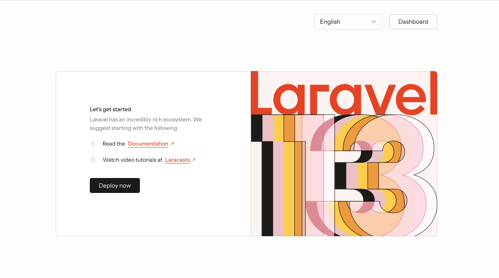

# Laravel Vue Starter

[Vietnamese / Tiếng Việt](README_VI.md)



A full-stack app using [Laravel](https://laravel.com) with a **Vue 3 SPA** (Composition API, TypeScript): [Vue Router](https://router.vuejs.org), [Pinia](https://pinia.vuejs.org), and [axios](https://axios-http.com) calling a REST API. Styling uses [Tailwind CSS](https://tailwindcss.com) v4 and [shadcn-vue](https://www.shadcn-vue.com). Authentication for the SPA is **Laravel Sanctum** personal access tokens (Bearer), stored in `localStorage` and sent on each request.

There is **no Inertia.js, Fortify, or Wayfinder** in this stack: the browser loads one Blade shell (`resources/views/app.blade.php`) and all app routes are handled client-side, except signed links (email verification, password reset) that hit Laravel first and then redirect into the SPA.

## Tech Stack

- **Backend**: Laravel 13, PHP 8.3+
- **Dashboard**: Vue 3.5 (Composition API), TypeScript 5
- **Styling UI**: Tailwind CSS v4, shadcn-vue (reka-ui)
- **State & Routing**: Pinia, Vue Router
- **Build Tool**: Vite 8
- **Authentication**: Laravel Sanctum
- **Package Manager**: pnpm 10, Composer

## Requirements

- PHP **8.3+** and [Composer](https://getcomposer.org)
- Node.js **22+** (recommended) and [pnpm](https://pnpm.io) — use the version that matches `packageManager` in `package.json` (Corepack: `corepack enable`)

## Quick setup

```bash
composer run setup
```

This installs PHP dependencies, creates `.env` if missing, runs `key:generate`, migrates the database, creates the `public/storage` symlink, runs `pnpm install`, and builds production assets.

**SQLite (default in `.env.example`):** ensure the database file exists before migrating:

```bash
touch database/database.sqlite
```

For MySQL or PostgreSQL, set `DB_*` in `.env`, then run `php artisan migrate`.

## Development

```bash
composer run dev
```

Runs `php artisan serve`, the queue worker, [Pail](https://laravel.com/docs/logging#pail) (logs), and Vite (`pnpm run dev`) together. Open the app at [http://127.0.0.1:8000](http://127.0.0.1:8000).

Frontend only:

```bash
pnpm run dev
```

## Project structure

High-level repository layout:

| Path                            | Role                                                                                                                                                        |
| ------------------------------- | ----------------------------------------------------------------------------------------------------------------------------------------------------------- |
| `app/Modules/Api/`              | Bounded context: HTTP API (`Http/Controllers`, `Http/Requests`, `Http/Resources`), services, repositories, events, `Models/User.php`, `Routes/api.php`      |
| `app/Http/Middleware/`          | Laravel middleware (e.g. appearance cookie)                                                                                                                 |
| `app/Providers/`                | Service providers                                                                                                                                           |
| `config/`                       | App config; `config/services.php` includes `services.dashboard.prefix` from `DASHBOARD_PREFIX` (default `admin`) for the SPA dashboard/settings URL segment |
| `database/`                     | Migrations, factories, seeders                                                                                                                              |
| `routes/`                       | `web.php` — SPA catch-all + signed verification/reset redirects; `console.php`                                                                              |
| `resources/views/app.blade.php` | Blade shell for the SPA; injects `window.__DASHBOARD_PREFIX__` before Vite                                                                                  |
| `resources/css/`                | Tailwind / global CSS entry                                                                                                                                 |
| `resources/js/`                 | Vue 3 SPA (TypeScript)                                                                                                                                      |
| `tests/`                        | PHPUnit feature tests                                                                                                                                       |

`resources/js/` (frontend) at a glance:

| Path                 | Role                                                                  |
| -------------------- | --------------------------------------------------------------------- |
| `app.ts` / `App.vue` | Entry, root layout; `App.vue` sets `lang` / `dir` (e.g. RTL for `ar`) |
| `router/`            | Vue Router; dashboard/settings paths use `config/dashboardPrefix.ts`  |
| `api/`               | Axios instance, auth header, API helpers                              |
| `stores/`            | Pinia (`auth`, `authConfig` — cached API config & social providers)   |
| `i18n/`              | `vue-i18n` setup; `locales/*.json` (`en`, `vi`, `ar`)                 |
| `layouts/`           | `app/` (sidebar shell), `auth/` (split / simple), `settings/`         |
| `pages/`             | Route views: `Welcome`, `Dashboard`, `auth/*`, `settings/*`           |
| `components/`        | App components + `ui/` (shadcn-vue primitives)                        |
| `composables/`       | Shared Vue composables                                                |
| `types/`             | TypeScript types                                                      |

## Useful scripts

| Command                                     | Description                                       |
| ------------------------------------------- | ------------------------------------------------- |
| `pnpm run build`                            | Production asset build (Vite)                     |
| `pnpm run build:ssr`                        | Client + SSR build (only if you add an SSR entry) |
| `pnpm run lint` / `pnpm run lint:check`     | ESLint                                            |
| `pnpm run format` / `pnpm run format:check` | Prettier (`resources/`)                           |
| `pnpm run types:check`                      | TypeScript check via `vue-tsc`                    |
| `composer run test`                         | Pint (dry-run) + PHPUnit                          |
| `composer run ci:check`                     | Frontend lint/format/types + tests                |

## Backend: `Api` module

HTTP JSON API and domain logic for auth, profile, password, and dashboard live in a **single bounded context**: `app/Modules/Api/` (models, repositories, services, events, controllers, form requests, API resources). Routes are registered from `app/Modules/Api/Routes/api.php` and prefixed **`/api/v1`**.

## REST API

[Laravel Sanctum](https://laravel.com/docs/sanctum) issues **personal access tokens**. After login or register, the SPA stores `token` and sends `Authorization: Bearer <token>` (see `resources/js/api/http.ts`).

| Method   | Path                            | Auth                 | Description                                                                                                                       |
| -------- | ------------------------------- | -------------------- | --------------------------------------------------------------------------------------------------------------------------------- |
| `POST`   | `/api/v1/auth/register`         | —                    | Register (`name`, `email`, `password`, `password_confirmation`, optional `device_name`) — returns token + user                    |
| `POST`   | `/api/v1/auth/token`            | —                    | Issue token (`email`, `password`, optional `device_name`)                                                                         |
| `POST`   | `/api/v1/auth/otp/request`      | —                    | Email sign-in: send 6-digit code (`email`) — same JSON message whether or not the user exists                                     |
| `POST`   | `/api/v1/auth/otp/verify`       | —                    | Redeem code (`email`, `code`, `device_name`?) — returns token or `two_factor_required` + `pending_token` like password login      |
| `DELETE` | `/api/v1/auth/token`            | Sanctum              | Revoke current token (logout)                                                                                                     |
| `POST`   | `/api/v1/auth/forgot-password`  | —                    | Request reset email (`email`)                                                                                                     |
| `POST`   | `/api/v1/auth/reset-password`   | —                    | Reset password (`token`, `email`, `password`, `password_confirmation`)                                                            |
| `POST`   | `/api/v1/auth/email/resend`     | Sanctum              | Resend email verification                                                                                                         |
| `GET`    | `/api/v1/me`                    | Sanctum              | Current user (`{ data: { ... } }`)                                                                                                |
| `PATCH`  | `/api/v1/me`                    | Sanctum              | Update name/email                                                                                                                 |
| `PUT`    | `/api/v1/me/password`           | Sanctum              | Change password (throttled)                                                                                                       |
| `DELETE` | `/api/v1/me`                    | Sanctum + `verified` | Delete account — JSON body: `{ "password": "..." }` (password accounts only; OAuth-only users must set a password first)          |
| `GET`    | `/api/v1/dashboard`             | Sanctum + `verified` | Dashboard overview JSON                                                                                                           |
| `GET`    | `/api/v1/auth/social/providers` | —                    | `{ data: { google, github } }` booleans (whether OAuth is configured)                                                             |
| `POST`   | `/api/v1/auth/social/exchange`  | —                    | After web OAuth callback: `{ "exchange_token": "...", "device_name"?: "spa" }` → token or `two_factor_required` + `pending_token` |
| `POST`   | `/api/v1/auth/token/two-factor` | —                    | `{ "pending_token", "code", "device_name"?: "spa" }` — completes login when 2FA is enabled                                        |
| `POST`   | `/api/v1/me/two-factor`         | Sanctum              | Start TOTP setup — returns `secret` + `otpauth_url`                                                                               |
| `POST`   | `/api/v1/me/two-factor/confirm` | Sanctum              | `{ "code" }` — enables 2FA; response includes one-time `recovery_codes`                                                           |
| `DELETE` | `/api/v1/me/two-factor`         | Sanctum              | Body: `{ "code", "current_password"?: "..." }` — disable 2FA (password required if the user has a password)                       |

Example:

```http
POST /api/v1/auth/token
Content-Type: application/json

{"email":"you@example.com","password":"secret","device_name":"spa"}
```

Then:

```http
GET /api/v1/me
Authorization: Bearer <token>
```

Run `php artisan migrate` after pull so `personal_access_tokens` exists.

## Web routes (SPA + signed links)

- Catch-all `/{any?}` serves the Vue app (`/storage/` and `/build/` are excluded so static assets resolve to files, not the SPA).
- `GET /auth/{google|github}/redirect` — starts OAuth (requires matching `GOOGLE_*` / `GITHUB_*` in `.env`).
- `GET /auth/{google|github}/callback` — Socialite callback; redirects to `/login?social_exchange=...` for the SPA to exchange via API.
- `verification.verify` — signed email verification; redirects to `/login?verified=1`.
- `password.reset` — redirects to `/reset-password?token=...&email=...` for the SPA.

When email/password login or social exchange succeeds and the user has confirmed 2FA, the API returns `two_factor_required` and a `pending_token` instead of a Bearer token; the SPA then posts to `/api/v1/auth/token/two-factor`.

## UI (shadcn-vue)

CLI config lives in `components.json`. Add components using the [shadcn-vue installation docs](https://www.shadcn-vue.com/docs/installation).

## Contributing

We love our contributors! Here's how you can contribute:

- [Open an issue](https://github.com/huuhabn/dashboard-laravel-vue/issues) if you believe you've encountered a bug.
- Make a [pull request](https://github.com/huuhabn/dashboard-laravel-vue/pull) to add new features/make quality-of-life improvements/fix bugs.
