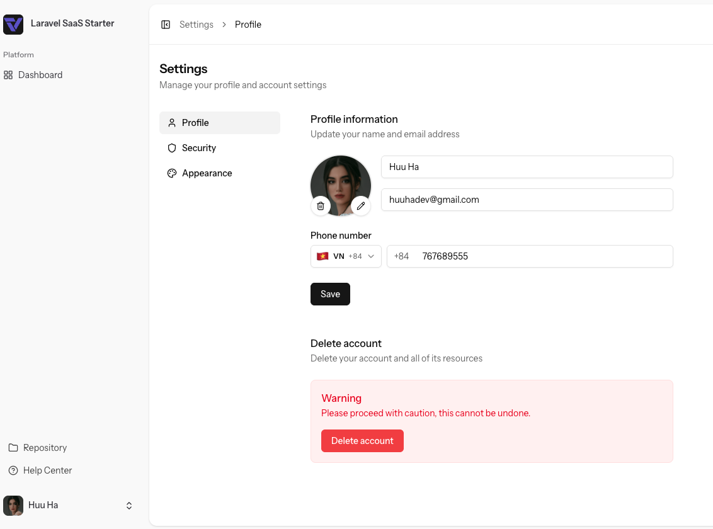

# Laravel Vue Starter

[English](README.md)



Ứng dụng full-stack dùng [Laravel](https://laravel.com) với **SPA Vue 3** (Composition API, TypeScript): [Vue Router](https://router.vuejs.org), [Pinia](https://pinia.vuejs.org) và [axios](https://axios-http.com) gọi REST API. Giao diện dùng [Tailwind CSS](https://tailwindcss.com) v4 và [shadcn-vue](https://www.shadcn-vue.com). Xác thực phía SPA là **Laravel Sanctum** (personal access token, Bearer), lưu trong `localStorage` và gửi kèm mỗi request.

**Không** dùng Inertia.js, Fortify hay Wayfinder: trình duyệt chỉ nhận một shell Blade (`resources/views/app.blade.php`), còn định tuyến ứng dụng do Vue Router xử lý; riêng link có chữ ký (xác minh email, đặt lại mật khẩu) vào Laravel trước rồi redirect vào SPA.

## Tech Stack

- **Backend**: Laravel 13, PHP 8.3+
- **Dashboard**: Vue 3.5 (Composition API), TypeScript 5
- **Styling UI**: Tailwind CSS v4, shadcn-vue (reka-ui)
- **State & Routing**: Pinia, Vue Router
- **Build Tool**: Vite 8
- **Authentication**: Laravel Sanctum
- **Package Manager**: pnpm 10, Composer

## Yêu cầu

- PHP **8.3+** và [Composer](https://getcomposer.org)
- Node.js **22+** (khuyến nghị) và [pnpm](https://pnpm.io) — phiên bản khớp `packageManager` trong `package.json` (Corepack: `corepack enable`)

## Cài đặt nhanh

```bash
composer run setup
```

Lệnh trên: cài PHP dependencies, tạo `.env` nếu thiếu, `key:generate`, migrate, tạo symlink `public/storage`, `pnpm install`, build asset production.

**SQLite (mặc định trong `.env.example`):** đảm bảo file DB tồn tại trước khi migrate:

```bash
touch database/database.sqlite
```

Nếu dùng MySQL/PostgreSQL, chỉnh `DB_*` trong `.env` rồi chạy `php artisan migrate`.

## Chạy môi trường development

```bash
composer run dev
```

Chạy đồng thời: `php artisan serve`, worker queue, [Pail](https://laravel.com/docs/logging#pail) (log), và Vite (`pnpm run dev`). Ứng dụng: [http://127.0.0.1:8000](http://127.0.0.1:8000).

Chỉ frontend:

```bash
pnpm run dev
```

## Cấu trúc thư mục

Tổng quan repository:

| Đường dẫn                       | Vai trò                                                                                                                                              |
| ------------------------------- | ---------------------------------------------------------------------------------------------------------------------------------------------------- |
| `app/Modules/Api/`              | Bounded context: API HTTP (`Http/Controllers`, `Http/Requests`, `Http/Resources`), service, repository, event, `Models/User.php`, `Routes/api.php`   |
| `app/Http/Middleware/`          | Middleware Laravel (ví dụ cookie giao diện)                                                                                                          |
| `app/Providers/`                | Service provider                                                                                                                                     |
| `config/`                       | Cấu hình app; `config/services.php` có `services.dashboard.prefix` từ `DASHBOARD_PREFIX` (mặc định `admin`) — segment URL dashboard/settings của SPA |
| `database/`                     | Migration, factory, seeder                                                                                                                           |
| `routes/`                       | `web.php` — catch-all SPA + redirect link có chữ ký; `console.php`                                                                                   |
| `resources/views/app.blade.php` | Shell Blade cho SPA; inject `window.__DASHBOARD_PREFIX__` trước Vite                                                                                 |
| `resources/css/`                | Entry Tailwind / CSS toàn cục                                                                                                                        |
| `resources/js/`                 | SPA Vue 3 (TypeScript)                                                                                                                               |
| `tests/`                        | PHPUnit feature test                                                                                                                                 |

`resources/js/` (frontend) tóm tắt:

| Đường dẫn            | Vai trò                                                                   |
| -------------------- | ------------------------------------------------------------------------- |
| `app.ts` / `App.vue` | Entry, layout gốc; `App.vue` gán `lang` / `dir` (ví dụ RTL khi `ar`)      |
| `router/`            | Vue Router; đường dẫn dashboard/settings dùng `config/dashboardPrefix.ts` |
| `api/`               | Axios, header auth, helper gọi API                                        |
| `stores/`            | Pinia (`auth`, `authConfig` — cache cấu hình API & social providers)      |
| `i18n/`              | Cấu hình `vue-i18n`; `locales/*.json` (`en`, `vi`, `ar`)                  |
| `layouts/`           | `app/` (shell sidebar), `auth/` (split / simple), `settings/`             |
| `pages/`             | View theo route: `Welcome`, `Dashboard`, `auth/*`, `settings/*`           |
| `components/`        | Component app + `ui/` (primitives shadcn-vue)                             |
| `composables/`       | Composable Vue dùng chung                                                 |
| `types/`             | Kiểu TypeScript                                                           |

## Scripts hữu ích

| Lệnh                                        | Mô tả                                    |
| ------------------------------------------- | ---------------------------------------- |
| `pnpm run build`                            | Build asset production (Vite)            |
| `pnpm run build:ssr`                        | Build client + SSR (chỉ khi bạn bật SSR) |
| `pnpm run lint` / `pnpm run lint:check`     | ESLint                                   |
| `pnpm run format` / `pnpm run format:check` | Prettier (`resources/`)                  |
| `pnpm run types:check`                      | `vue-tsc` kiểm tra TypeScript            |
| `composer run test`                         | Pint (dry-run) + PHPUnit                 |
| `composer run ci:check`                     | Lint/format/types (frontend) + test      |

## Backend: module `Api`

API JSON và nghiệp vụ (đăng ký/đăng nhập token, hồ sơ, mật khẩu, dashboard) nằm trong **một bounded context**: `app/Modules/Api/` (model, repository, service, event, controller, request, resource). Route đăng ký từ `app/Modules/Api/Routes/api.php`, prefix **`/api/v1`**.

## REST API

[Laravel Sanctum](https://laravel.com/docs/sanctum) cấp **personal access token**. Sau đăng nhập/đăng ký, SPA lưu `token` và gửi `Authorization: Bearer <token>` (xem `resources/js/api/http.ts`).

| Method   | Path                            | Auth                 | Mô tả                                                                                                                    |
| -------- | ------------------------------- | -------------------- | ------------------------------------------------------------------------------------------------------------------------ |
| `POST`   | `/api/v1/auth/register`         | —                    | Đăng ký (`name`, `email`, `password`, `password_confirmation`, tùy chọn `device_name`) — trả token + user                |
| `POST`   | `/api/v1/auth/token`            | —                    | Cấp token (`email`, `password`, tùy chọn `device_name`)                                                                  |
| `POST`   | `/api/v1/auth/otp/request`      | —                    | Đăng nhập bằng email: gửi mã 6 số (`email`) — cùng thông báo JSON dù có tài khoản hay không                              |
| `POST`   | `/api/v1/auth/otp/verify`       | —                    | Đổi mã (`email`, `code`, `device_name`?) — trả token hoặc `two_factor_required` + `pending_token` như đăng nhập mật khẩu |
| `DELETE` | `/api/v1/auth/token`            | Sanctum              | Thu hồi token hiện tại (logout)                                                                                          |
| `POST`   | `/api/v1/auth/forgot-password`  | —                    | Gửi email đặt lại mật khẩu (`email`)                                                                                     |
| `POST`   | `/api/v1/auth/reset-password`   | —                    | Đặt lại mật khẩu (`token`, `email`, `password`, `password_confirmation`)                                                 |
| `POST`   | `/api/v1/auth/email/resend`     | Sanctum              | Gửi lại email xác minh                                                                                                   |
| `GET`    | `/api/v1/me`                    | Sanctum              | User hiện tại (`{ data: { ... } }`)                                                                                      |
| `PATCH`  | `/api/v1/me`                    | Sanctum              | Cập nhật tên/email                                                                                                       |
| `PUT`    | `/api/v1/me/password`           | Sanctum              | Đổi mật khẩu (giới hạn tần suất)                                                                                         |
| `DELETE` | `/api/v1/me`                    | Sanctum + `verified` | Xóa tài khoản — body `{ "password": "..." }` (chỉ tài khoản có mật khẩu; tài khoản chỉ OAuth cần đặt mật khẩu trước)     |
| `GET`    | `/api/v1/dashboard`             | Sanctum + `verified` | Dữ liệu dashboard                                                                                                        |
| `GET`    | `/api/v1/auth/social/providers` | —                    | `{ data: { google, github } }` — provider nào đã cấu hình                                                                |
| `POST`   | `/api/v1/auth/social/exchange`  | —                    | Sau OAuth web: `{ "exchange_token", "device_name"?: "spa" }` → token hoặc `two_factor_required` + `pending_token`        |
| `POST`   | `/api/v1/auth/token/two-factor` | —                    | `{ "pending_token", "code", "device_name"?: "spa" }` — hoàn tất đăng nhập khi bật 2FA                                    |
| `POST`   | `/api/v1/me/two-factor`         | Sanctum              | Bắt đầu cấu hình TOTP — trả `secret` + `otpauth_url`                                                                     |
| `POST`   | `/api/v1/me/two-factor/confirm` | Sanctum              | `{ "code" }` — bật 2FA; trả `recovery_codes` (chỉ hiện một lần)                                                          |
| `DELETE` | `/api/v1/me/two-factor`         | Sanctum              | Body `{ "code", "current_password"?: "..." }` — tắt 2FA (có mật khẩu thì bắt buộc `current_password`)                    |

Sau khi clone/cập nhật, chạy `php artisan migrate` để có bảng `personal_access_tokens`.

## Route web (SPA + link có chữ ký)

- Catch-all `/{any?}` trả về ứng dụng Vue (`/storage/` và `/build/` được loại trừ để file tĩnh không đi qua SPA).
- `GET /auth/{google|github}/redirect` — bắt đầu OAuth (cần `GOOGLE_*` / `GITHUB_*` trong `.env`).
- `GET /auth/{google|github}/callback` — Socialite callback; redirect `/login?social_exchange=...` để SPA đổi lấy token qua API.
- `verification.verify` — xác minh email có chữ ký; redirect `/login?verified=1`.
- `password.reset` — redirect sang `/reset-password?token=...&email=...` cho SPA.

Nếu user bật 2FA, `POST /auth/token` hoặc `POST /auth/social/exchange` trả `two_factor_required` và `pending_token` thay vì Bearer token; SPA gọi tiếp `POST /api/v1/auth/token/two-factor`.

## Giao diện (shadcn-vue)

Cấu hình CLI nằm trong `components.json`. Thêm component theo [tài liệu shadcn-vue](https://www.shadcn-vue.com/docs/installation).

## Ghi chú pnpm

Repo dùng **pnpm**; `package-lock.json` được bỏ qua. Trong `.npmrc` có `ignore-workspace=true` để project luôn là root riêng nếu máy bạn có workspace pnpm ở thư mục cha. Bỏ dòng đó nếu bạn cố ý gói project vào một monorepo pnpm lớn hơn.

## Quy tắc triển khai Repository + Contract + Service

```
Bạn có cần gọi Model này từ Job/Queue không?      → Service
Bạn có cần unit test không hit database không?    → Repository + Contract
Bạn có tích hợp API bên ngoài không?              → Service
Query này có dùng lại ở 3+ nơi không?             → Repository
Có state machine / nhiều trạng thái không?        → Service
```

### Repository + Contract + Service:

Logic phức tạp, tái sử dụng cao, cần test nghiêm túc

- Order: Trạng thái phức tạp, liên quan Payment, Inventory, Email
- User
- Payment
- Subscription
- Invoice
- Inventory

### Service only:

Có business logic nhưng không cần swap/mock repository

- Notification
- Report / Analytics
- Media file
- Coupon/ Discount
- Search

### Eloquent trực tiếp

CRUD đơn giản, ít logic, không cần tái sử dụng

- Setting
- Activity log
- Category
- Address
- Profile
